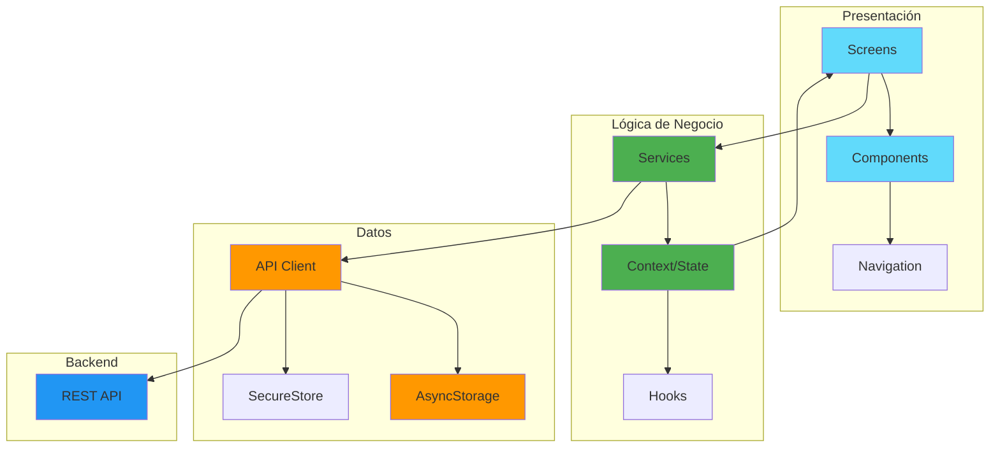

<div align="center">

# 🌟 Soma - Frontend

### Tu Compañero de Bienestar Inteligente

Una aplicación móvil de salud y bienestar desarrollada con React Native y Expo que te ayuda a gestionar el estrés, mejorar el sueño, mantenerte hidratado y alcanzar tus objetivos de bienestar.

[](https://reactnative.dev/)
[](https://expo.dev/)
[](LICENSE)
[](https://nodejs.org/)

</div>

---

## 📱 Características Principales

### 💆 Gestión del Estrés
- **Monitoreo en Tiempo Real**: Seguimiento continuo de niveles de estrés
- **Respiración Guiada**: Ejercicios personalizados (4-7-8, Box Breathing, etc.)
- **Sesiones Anti-Estrés**: Técnicas de relajación con música ambiental
- **Indicadores Visuales**: Gráficos interactivos de evolución del estrés

### 😴 Optimización del Sueño
- **Alarma Inteligente**: Despertador que se adapta a tus fases de sueño
- **Análisis de Sueño**: Evaluación de calidad y patrones de descanso
- **Modo Insomnio**: Herramientas específicas para mejorar el sueño
- **Registro de Eventos**: Seguimiento de despertares nocturnos

### 💧 Hidratación Inteligente
- **Objetivos Personalizados**: Configura tu meta diaria de hidratación
- **Recordatorios**: Notificaciones inteligentes para beber agua
- **Seguimiento Visual**: Gráficos de progreso diario
- **Historial**: Análisis de hábitos de hidratación

### 🎯 Hábitos y Bienestar
- **Gestión de Hábitos**: Crea y mantén hábitos saludables
- **Predicción de Bienestar**: IA que predice tu estado de bienestar
- **Resumen Diario**: Vista consolidada de todas tus métricas
- **Evolución**: Gráficos históricos de tu progreso

### 🎵 Contenido Personalizado
- **Recomendaciones Musicales**: Música adaptada a tu estado de ánimo
- **Chat de Soporte**: Asistencia en tiempo real
- **Ayuda Profesional**: Contacto con profesionales de la salud

### 👤 Personalización
- **Perfil Completo**: Gestión de datos personales y foto de perfil
- **Configuración Avanzada**: Idioma, región, notificaciones
- **Rasgos Personales**: Personaliza la experiencia según tu personalidad
- **Tema Adaptativo**: Colores dinámicos según el modo activo

---

## 🏗️ Arquitectura



---

## 🛠️ Stack Tecnológico

| Categoría | Tecnologías |
|-----------|-------------|
| **Framework** | React Native 0.81.5, Expo 54 |
| **Navegación** | React Navigation (Stack + Bottom Tabs) |
| **Estado Global** | React Context API |
| **HTTP Client** | Axios |
| **Almacenamiento** | AsyncStorage, Expo SecureStore |
| **Gráficos** | React Native Gifted Charts, Recharts |
| **UI Components** | React Native Paper, Vector Icons |
| **Multimedia** | Expo AV, Linear Gradient |
| **Notificaciones** | Expo Notifications |
| **Fuentes** | Expo Google Fonts (Afacad) |
| **Utilidades** | DateTimePicker, Picker |

---

## 📂 Estructura del Proyecto

```
Soma/
├── src/
│   ├── assets/              # Recursos estáticos (imágenes, audio)
│   ├── components/          # Componentes reutilizables
│   │   ├── CustomButton.js
│   │   ├── CustomInput.js
│   │   ├── HydrationCard.js
│   │   ├── InfoModal.js
│   │   └── ...
│   ├── config/              # Configuración de la app
│   │   └── apiConfig.js     # URL del backend y configuración HTTP
│   ├── constants/           # Constantes globales
│   │   ├── Colors.js        # Paleta de colores
│   │   ├── Typography.js    # Estilos de texto
│   │   ├── Spacing.js       # Sistema de espaciado
│   │   └── ...
│   ├── context/             # Context API para estado global
│   │   ├── ThemeContext.js  # Gestión de tema dinámico
│   │   ├── UserContext.js   # Gestión de usuario
│   │   └── ...
│   ├── hooks/               # Custom hooks
│   │   └── useAuth.js
│   ├── navigation/          # Configuración de navegación
│   │   ├── AppNavigator.js
│   │   └── BottomTabNavigator.js
│   ├── screens/             # Pantallas de la aplicación
│   │   ├── HomeScreen.js
│   │   ├── StressScreen.js
│   │   ├── SmartAlarmScreen.js
│   │   ├── DailySummaryScreen.js
│   │   └── ...
│   ├── services/            # Servicios para comunicación con backend
│   │   ├── authService.js
│   │   ├── userService.js
│   │   ├── hydrationService.js
│   │   ├── stressService.js
│   │   └── ...
│   └── utils/               # Utilidades y helpers
│       ├── dateUtils.js
│       └── ...
├── App.js                   # Punto de entrada de la aplicación
├── app.json                 # Configuración de Expo
├── package.json             # Dependencias
└── README.md                # Este archivo
```

---

## 🚀 Comenzar

### Prerequisitos

- **Node.js** 18 o superior
- **npm** o **yarn**
- **Expo CLI** (se instalará automáticamente)
- **Dispositivo móvil** con la app Expo Go o **emulador** (Android Studio / Xcode)

### Instalación

1. **Clona el repositorio**
```bash
git clone <tu-repositorio>
cd Soma-FrontEnd/Soma
```

2. **Instala las dependencias**
```bash
npm install
```

3. **Configura la URL del backend**
   
   Edita el archivo `src/config/apiConfig.js` y actualiza la URL del backend:
   ```javascript
   export const API_BASE_URL = 'http://TU_IP:8080/api';
   ```

> [!IMPORTANT]
> **🔐 Configuración del Backend**: El backend requiere API keys de servicios externos (Gemini y Spotify).
> 
> Antes de ejecutar el frontend, asegúrate de que el backend esté correctamente configurado siguiendo las instrucciones en [Soma-BackEnd/README.md](../../Soma-BackEnd/README.md) y [API_CONFIGURATION.md](../../API_CONFIGURATION.md).

4. **Inicia la aplicación**
```bash
npm start
```

5. **Ejecuta en tu dispositivo**
   - **Android**: Presiona `a` o escanea el QR con Expo Go
   - **iOS**: Presiona `i` o escanea el QR con la cámara
   - **Web**: Presiona `w`

---

## 📱 Capturas de Pantalla

> 🎨 *Sección reservada para capturas de pantalla de la aplicación*

---

## 🔌 Integración con Backend

La aplicación se conecta al backend de Soma a través de servicios REST API:

- **Base URL**: Configurada en `src/config/apiConfig.js`
- **Autenticación**: Tokens almacenados en SecureStore
- **Endpoints**: Documentados en el README del backend

### Servicios Principales

| Servicio | Propósito |
|----------|-----------|
| `authService.js` | Login, registro, autenticación |
| `userService.js` | Gestión de perfil y usuario |
| `stressService.js` | Monitoreo y sesiones anti-estrés |
| `hydrationService.js` | Logs y configuración de hidratación |
| `alarmService.js` | Configuración de alarma inteligente |
| `summaryService.js` | Resumen diario y estadísticas |
| `wellnessService.js` | Predicciones de bienestar |

---

## 🎨 Sistema de Diseño

### Colores Dinámicos

La app utiliza un sistema de colores que se adapta según el modo activo (estrés, insomnio, fatiga):

```javascript
// Colors.js
export const ModeColors = {
  stress: { primary: '#4A90E2', secondary: '#FFA500', ... },
  insomnia: { primary: '#9B59B6', secondary: '#3498DB', ... },
  fatigue: { primary: '#E74C3C', secondary: '#F39C12', ... }
};
```

### Tipografía

Sistema consistente basado en la fuente **Afacad**:

- **Títulos**: 28-32px
- **Subtítulos**: 18-22px
- **Contenido**: 15-16px
- **Pequeño**: 12-14px

### Espaciado

Sistema basado en múltiplos de 4px para consistencia:

```javascript
export const Spacing = {
  xs: 4, sm: 8, md: 16, lg: 24, xl: 32, xxl: 48
};
```

---

## 🤝 Contribuir

1. Fork el proyecto
2. Crea una rama para tu feature (`git checkout -b feature/AmazingFeature`)
3. Commit tus cambios (`git commit -m 'Add: nueva característica'`)
4. Push a la rama (`git push origin feature/AmazingFeature`)
5. Abre un Pull Request

---

## 📄 Licencia

Este proyecto está bajo la licencia 0BSD.

---

## 👨‍💻 Desarrollado con ❤️

Soma - Tu bienestar, nuestra prioridad

---

<div align="center">

**[⬆ Volver arriba](#-soma---frontend)**

</div>
